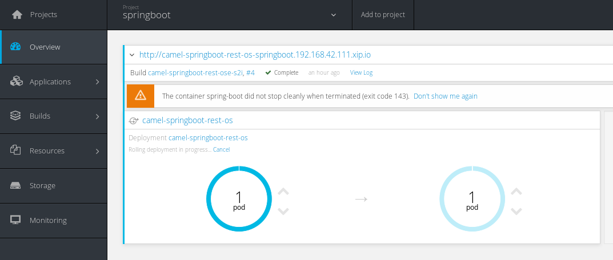

# Spring-Boot REST Camel XML

This example demonstrates how to configure Camel routes in Spring Boot via
a Spring XML configuration file.

The application utilizes the Spring [`@ImportResource`](http://docs.spring.io/spring/docs/current/javadoc-api/org/springframework/context/annotation/ImportResource.html) annotation to load a Camel Context definition via a [camel-context.xml](src/main/resources/spring/camel-context.xml) file on the classpath.

### Building

The example can be built with

    mvn clean install


### Running the example locally

The example can be run locally using the following Maven goal:

    mvn spring-boot:run


### Zero Downtime - Hot Reload of your Camel microservice on OpenShift

It is assumed a running OpenShift platform is already running. If not you can find details how to [get started](http://fabric8.io/guide/getStarted/index.html).

Assuming your current shell is connected to OpenShift so that you can type the following command to 
package your microservice, run it on OpenShift and get the output the logs from the running pods :

```
mvn clean install fabric8:deploy -Dfabric8.deploy.createExternalUrls=true fabric8:log
```

To list all the running pods:

    oc get pods

To invoke the Rest endpoint of your camel microserice every 1 second:

```sh
watch -n1 -c ab -n 10 http://camel-springboot-rest-os-springboot.192.168.42.111.xip.io/api/persons/Abel

Every 1.0s: curl http://camel-springboot-rest-os-springboot.192.168.42.111.xip.io/api/per...  Tue Jan 24 10:38:05 2017

  % Total    % Received % Xferd  Average Speed   Time    Time     Time  Current
                                 Dload  Upload   Total   Spent    Left  Speed
   0     0    0     0    0     0      0      0 --:--:-- --:--:-- --:--:--     0 100    85    0    85    0     0    665
      0 --:--:-- --:--:-- --:--:--   669
Hey Abel --> Enjoy your camel microservices | POD : camel-springboot-rest-os-10-4cxix

```

The output of the Rest service mention the pod that handle the request.

To configure your camel route, We will use a the following approach

    Environment variables

All the endpoints of the route camel are defined as Environment variables properties.
All these environment variables are declared in `fabric8/deployment.yml`

To update your Camel you have only to update the DeploymentConfig, like following:

```sh
$ oc env dc/camel-springboot-rest-os CAMEL_LOG_MSG="LOG UPDATED - This request is handled by this POD: {{env:HOSTNAME}}"
deploymentconfig "camel-springboot-rest-os" updated
```

Now you have just to watch the running pods:

```sh
oc get pods -w | grep Running
[aboucham@aboucham camel-springboot-rest-ose]$ oc get pods -w | grep Running
camel-springboot-rest-os-10-4cxix            1/1       Running     0          7m
camel-springboot-rest-os-11-deploy           1/1       Running     0          3s
camel-springboot-rest-os-11-y00ny            0/1       Running     0          3s
camel-springboot-rest-os-11-y00ny            1/1       Running     0          31s
```



Once the new pod is deployed & Running, you will see the output of our Rest service updated 
with the new pod running:

```sh
Hey Abel --> Enjoy your camel microservices | POD : camel-springboot-rest-os-11-y00ny
```

Enjoy!!